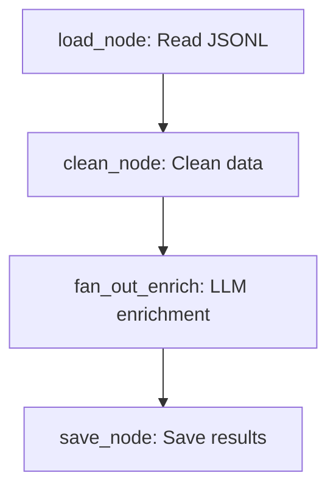

# ETL Agent - Data Enrichment Pipeline

A LangGraph-based ETL (Extract, Transform, Load) agent that enriches structured data using LLM classification and parallel processing.

## 🎯 Project Overview

This project demonstrates **LangGraph Pattern #5: Fan-out concurrency + Join** by:
- Loading raw user data from JSONL files
- Cleaning and sanitizing the data
- Enriching each row in parallel using LLM classification
- Joining results and saving to structured output

## 🏗️ Architecture



## 📁 Project Structure

```
etl-agent/
├── raw_data/
│   └── users.jsonl               # Input data
├── outputs/
│   └── enriched.jsonl            # Output data (generated)
├── nodes/
│   ├── __init__.py
│   ├── load_node.py              # Data loading
│   ├── clean_node.py             # Data cleaning
│   ├── enrich_node.py            # LLM enrichment
│   ├── join_node.py              # Result aggregation
│   └── save_node.py              # Output writing
├── graph.py                      # StateGraph configuration
├── run_etl.py                    # CLI runner
├── environment.yaml              # Conda environment
├── .env                          # Environment variables
└── README.md
```

## 🚀 Quick Start

### 1. Setup Environment

```bash
# Create conda environment
conda env create -f environment.yaml
conda activate etl-agent

# Or use pip
pip install langgraph langchain langchain-openai python-dotenv openai
```

### 2. Configure API Key

Edit `.env` file and add your OpenAI API key:
```bash
OPENAI_API_KEY=your_actual_api_key_here
```

### 3. Run the Pipeline

```bash
python run_etl.py
```

## 📊 Sample Data

### Input (`raw_data/users.jsonl`)
```json
{"name": "Emily Wang", "bio": "Product manager passionate about climate tech, formerly at Google X"}
{"name": "Ravi Patel", "bio": "Ex-finance guy turned founder. Exploring AI + quant research. Boston based."}
```

### Output (`outputs/enriched.jsonl`)
```json
{"name": "Emily Wang", "bio": "Product manager passionate about climate tech, formerly at Google X", "category": "Product", "tags": ["climate tech", "product management", "Google X"], "location": "USA", "seniority": "Senior"}
{"name": "Ravi Patel", "bio": "Ex-finance guy turned founder. Exploring AI + quant research. Boston based.", "category": "Founder", "tags": ["finance", "AI", "quant research", "founder"], "location": "Boston, USA", "seniority": "Executive"}
```

## 🔧 Enrichment Fields

The LLM enriches each row with:
- **category**: Job function (Product, Engineering, Research, etc.)
- **tags**: 3-6 relevant keywords
- **location**: Inferred city/country
- **seniority**: Experience level (Entry, Mid-level, Senior, Executive)

## 🧠 Key Learning Points

| LangGraph Feature | Implementation |
|------------------|----------------|
| State Management | `ETLState` TypedDict |
| Sequential Processing | `load → clean → enrich → save` |
| Fan-out Pattern | Parallel row enrichment |
| Error Handling | Graceful LLM failure recovery |
| Structured Output | JSONL format preservation |

## 🎛️ Customization

### Add New Enrichment Fields
Edit `nodes/enrich_node.py` and update the prompt template:
```python
PROMPT = ChatPromptTemplate.from_template("""
Given this person's bio: "{bio}", return a JSON object with:
- category (existing field)
- your_new_field (description)
...
""")
```

### Change Input/Output Formats
- Modify `nodes/load_node.py` for different input formats
- Modify `nodes/save_node.py` for CSV, database, or other outputs

### Adjust Concurrency
The current implementation processes rows sequentially in the fan-out function. For true parallel processing, consider using `asyncio` or threading.

## 🐛 Troubleshooting

**API Key Issues:**
- Ensure `.env` file contains valid `OPENAI_API_KEY`
- Check API key permissions and billing

**Import Errors:**
- Verify all dependencies are installed: `pip list | grep langchain`
- Ensure you're in the correct conda environment

**Empty Output:**
- Check input file format (valid JSONL)
- Verify LLM responses are valid JSON

## 🔄 Real-World Extensions

- **Database Integration**: Replace JSONL with PostgreSQL/MongoDB
- **Batch Processing**: Handle large datasets with chunking
- **Custom Models**: Use local LLMs or specialized models
- **Validation**: Add schema validation for enriched data
- **Monitoring**: Add logging and metrics collection

## 📝 License

This project is for educational purposes. Feel free to modify and extend!
